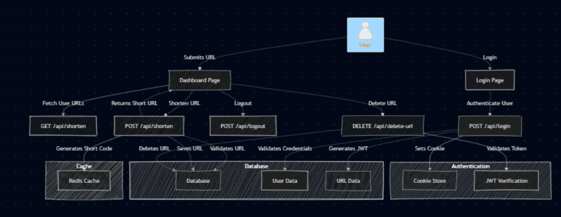

# Shrinq.link - URL Shortener

A simple and efficient URL shortener built with Next.js and SQLite for secure and fast URL management.

## Features ✨

- Shorten URLs easily
- Click analytics for shortened URLs
- User authentication with JWT and bcrypt
- Temporary caching with Redis
- Simple and responsive UI

## Tech Stack 💻

- **Frontend & Backend**: Next.js, Shadcn
- **Authentication**: JWT, bcrypt
- **Database**: SQLite (Turso), Drizzle ORM
- **Caching**: Redis (Upstash)

## Architecture 📊

